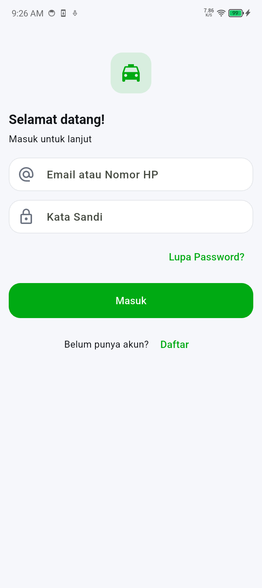

# Sample App Gojek-Style (Flutter)

Proyek contoh aplikasi Flutter dengan gaya UI ala Gojek. Fokus pada pengalaman beranda: navigasi bawah Material 3, grid layanan cepat (quick menu), banner promosi, kartu dompet, daftar promo, dan bottom sheet “Layanan lainnya”. Tersedia juga layar Autentikasi (Login, Register, Lupa/Reset Password), Notifikasi, Chat, dan beberapa layar contoh lain.

## Fitur Utama
- Navigasi bawah: `NavigationBar` Material 3 yang konsisten via tema.
- Quick menu: grid layanan (GoRide, GoCar, GoFood, GoSend, dll.).
- Lainnya: saat tile “Lainnya” ditekan, muncul bottom sheet berisi layanan tambahan dalam beberapa kategori.
- Promo & rekomendasi: komponen kartu promo dan rekomendasi makanan.
- Tema aplikasi: warna, tipografi, tombol, input, dan komponen lain distandarkan di `AppTheme`.

## Cuplikan Layar

> File gambar berada di folder `Screenshot/` pada root repo.

| Dashboard | Login | Register |
|---|---|---|
|  |  |  |

| Forgot Password | Reset Password | Promotion |
|---|---|---|
|  |  |  |

| Activity | Chat |
|---|---|
|  |  |

## Persyaratan
- Flutter 3.22+ (Dart 3.4+)
- Platform SDK sesuai target (Android SDK / Xcode / Desktop toolchain)

Periksa versi Flutter Anda:

```
flutter --version
```

## Menjalankan Proyek
1. Clone repo ini, lalu masuk ke folder proyek.
2. Install dependensi:
   
   ```
   flutter pub get
   ```
3. Jalankan di device/emulator yang aktif:
   
   ```
   flutter run
   ```

Per platform:
- Android: aktifkan emulator atau hubungkan perangkat, lalu `flutter run -d android`.
- iOS: gunakan Xcode + simulator, lalu `flutter run -d ios` (butuh macOS).
- Web: `flutter run -d chrome`.
- Desktop (Windows/Mac/Linux): aktifkan support desktop (`flutter config --enable-windows-desktop`, dll.), lalu `flutter run -d windows` (atau platform terkait).

## Struktur Proyek Singkat
- `lib/main.dart`: titik masuk aplikasi.
- `lib/core/`: konstanta UI dan tema (`AppTheme`).
- `lib/screens/`: halaman aplikasi (Dashboard, Promo, Activity, Chat, Auth, dll.).
- `lib/widgets/`: komponen UI (navigation bar, header pencarian, kartu, sheet, dll.).
- `lib/data/sample_data.dart`: data contoh untuk fitur, promo, dan layanan tambahan.

## Catatan Implementasi
- Bottom navigation menggunakan `NavigationBar` (Material 3) dan distandarkan di `AppTheme.navigationBarTheme`.
- Quick menu “Lainnya” memanggil `showMoreServicesSheet(context)` yang menampilkan bottom sheet:
  - Bagian “Layanan teratas”: grid ikon layanan.
  - Bagian “Layanan lainnya”: daftar layanan per kategori beserta deskripsi singkat.
- Efek hover/click hanya pada kartu ikon quick menu (bukan label), cocok untuk web/desktop; di mobile, ripple tap hanya pada ikon.

## Menambah/Mengubah Layanan
- Edit daftar quick menu: `lib/data/sample_data.dart` → `sampleFeatures`.
- Edit konten bottom sheet: `sampleMoreServiceSections` di file yang sama.
- Aksi tap “Lainnya” ditangani di `lib/screens/dashboard/dashboard_screen.dart`.
- Aksi tap pada item lain (yang belum punya halaman) sementara menampilkan `SnackBar` di tempat yang sama.

## Build Rilis Singkat
```
flutter build apk --release
flutter build appbundle --release
flutter build ios --release
flutter build web --release
```

## Lisensi
Proyek contoh ini untuk tujuan pembelajaran dan demo UI. Silakan gunakan/ubah sesuai kebutuhan Anda.
